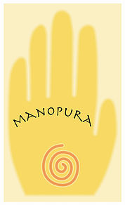

# Welkom in de Intuïtieschool!   
# Welkom in Het Ankher!

Hier kom je alles te weten over intuïtie, je eigen intuïtief aanvoelen, je creatieve kracht, ...
Je leert ze (her)kennen, erop vertrouwen, verder ontwikkelen, en gebruiken in je dagdagelijks leven.   

Er worden regelmatig opleidingen georganiseerd, workshops, readings/healings,... om je verder te begeleiden. 

Het logo van De Intuïtieschool en de naam Het Ankher behoeven misschien een beetje duiding:   

Het **ankh-teken** is een oud Egyptisch symbool dat je overal in tempels en muurschilderingen terug kan vinden. Het staat symbool voor levenskracht, adem, bescherming, de link tussen dit leven en de onsterfelijkheid.   

Het **anker** op zich staat symbool voor stabiliteit, zekerheid, verankerd zijn, stevige basis.   

Je zou er tevens ook een maansikkel kunnen in zien; de **maan** als symbool voor vrouwelijkheid, vrouwelijke kracht, krachtbron voor zelfreflectie.   

Al deze symbolen samen zorgen ervoor dat de klemtoon in de Intuïtieschool Het Ankher ligt op het groeien in bewustzijn van wie jij werkelijk bent, in het licht van jouw levenskracht en goddelijke inspiratie. 
Dat vormt een solide basis met stevige fundamenten, van waaruit jij ten volle in jouw kracht kan staan en het leven leiden dat bij jou past. 

# Mijn intuïtief pad

Mijn pad in die zin was hobbelig. Ik herinner me dat ik als 5 jarige zat te spelen met zelfgemaakte pendels. Tijdens mijn puberteit heb ik zowat alle boeken uit de bibliotheek gelezen over para-normale zaken. Voor mij voelde het zeer vertrouwd; maar het gevoel was dubbel, er zat ook veel angst bij. Angst voor het onbekende, het onverklaarbare. En daarom hield ik dat potje dicht. Maar als het je pad is, krijg je zo nu en dan een por. En als die por niet duidelijk genoeg was, komt er nog 1 en nog 1. Tot het groter moet, een hamer. Figuurlijk. Rond mijn 35e had ik eindelijk begrepen dat ik er wat mee aan moest, met mijn intuïtie. Maar wat? en daar begon mijn ontdekkingstocht! Ik heb het hele spectrum aan opleidingen doorploegd, van de meest zweverige tot de meest aardse, zodat ik goed kon inschatten hoe je intuïtie als deel van je leven maakt. 

Intuïtie en energie gaan voor mij hand in hand. Als alles goed stroomt, als je energie geen blokkades kent, dan stroomt ook de intuïtie, de bron van informatie over je leven, jouw 'weten'. 
Intuïtie en ontspanning horen ook bij elkaar. Je hebt maar oor voor je buikgevoel als je geen overmatige stress te verwerken hebt.

Ik ben heel blij met deze gang van zaken, het liep zoals het moest lopen, voor mij. En al mijn ervaring deel ik graag met jou, zodat ook jij kan genieten van jouw ontdekkingstocht!

# Missie  
Het Ankher is een opleidingscentrum waar intuïtie, zelfontwikkeling, groei naar dieper bewustzijn centraal staan. Het wil een tegengewicht bieden aan het huidige opleidingsaanbod waar veelal het accent ligt op mentale processen. Het wil het 'zesde' zintuig terug in het daglicht stellen, op een nuchtere manier.  

# Voor wie kan het Ankher iets betekenen?

+ voor mensen op zoek naar diepgang, die intuïtief weten dat er meer is, en daarin begeleiding zoeken
+ voor mensen die merken dat ze een 'gave' hebben maar daar verder niets over weten en het willen verkennen
+ voor mensen die goed kunnen aanvoelen
+ voor mensen die bereid zijn aan zichzelf te willen werken
+ hoogsensitieve mensen (HSP)
+ voor vrouwen die door omstandigheden (werk of privé) zeer mentaal geworden zijn, en terug connectie willen maken met hun aangeboren intuïtie en aanvoelen.

---  

Volg ons op [**Facebook**](https://www.facebook.com/manopura/) voor het laatste nieuws!

---

