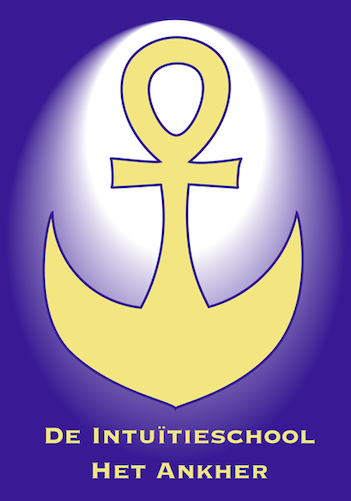
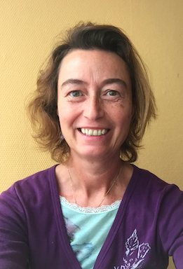

### "I am the master of my fate, I am the captain of my soul" - W.Henley

---

Welkom bij Het Ankher! Hier kom je alles te weten over energie, intuïtie, diepgang, je eigen aanvoelen, je creatieve kracht, bewustwording, kortom alles wat je kan helpen aan persoonlijke ontwikkeling en groei...
Je leert jezelf (her)kennen, je lichaam opnieuw voelen, meer vertrouwen hebben op je aanvoelen en een waardevol leven te leiden volgens jouw Waarheid en kracht. 

Het Ankher is niet zozeer een opleidingscentrum in de letterlijke zin van het woord, maar eerder een plek waar je tot jezelf kan komen, en indien dat moeilijk gaat, om het aan te leren hoe je het kan doen. Heb je vragen over welk richting je uit wil in je leven? ben je op zoek naar meer verdieping? Voel je dat er iets meer is, maar je weet niet wat precies? Wil je meer weten over 'energie' in het algemeen en hoe je de energie flow in je lichaam kan bevorderen? Wil je de signalen van je lichaam beter begrijpen? Dan vind je hier beslist wel iets dat je kan vooruit helpen!   

# Achtergrond   

Het **ankh-teken** in het logo is een oud Egyptisch symbool dat je overal in tempels terug kan vinden. Het staat symbool voor levenskracht, adem, bescherming, de link tussen dit leven en de onsterfelijkheid.   

Het **anker** staat symbool voor stabiliteit, zekerheid, verankerd zijn, stevige basis.   

In het onderste deel zou je ook een maansikkel kunnen zien; de **maan** als symbool voor vrouwelijkheid, vrouwelijke kracht, krachtbron voor zelfreflectie.   

Al deze symbolen samen zorgen ervoor dat de klemtoon in de Intuïtieschool Het Ankher ligt op het groeien in bewustzijn van wie jij werkelijk bent, in het licht van jouw levenskracht en goddelijke inspiratie/ intuïtie. Er is een massa aan energie om ons heen en in onszelf waar we gebruik van kunnen leren maken.
Dat vormt een solide basis met stevige fundamenten, van waaruit jij ten volle in jouw kracht kan staan, jouw leven ontdekken!

De wereld en de mens heeft nood aan meer diepgang, meer bewustzijn. We leven in een wegwerpcultuur, in een virtuele wereld op tablet, smartphone, games,... De mens vervreemt van zijn eigen natuur. Veel mensen beginnen te merken dat het zo niet meer klopt. Maar wat mankeert er dan? Het Ankher wil meer inzicht helpen brengen, en het besef wakker maken dat ieder mens beschikt over een enorme bron aan innerlijke intelligentie, energie, intuïtie, zelfhelend vermogen, bewustzijn. Dat helpt om een leven te leiden dat 'zin' heeft, dat je vervult met een wezenlijk goed gevoel.   

Bij het Ankher kan je terecht voor persoonlijke begeleiding, opleidingen, workshops, readings/healings,...   

Dat gebeurt vooral via de insteek van "oude wijsheden" uit het Oosten:    
* Shiatsu: Japanse traditionele lichaamsbehandeling,    
* de Oosterse 5-elementen-leer (Water, Hout, Vuur, Aarde, Metaal): verkennen hoe alles aan elkaar gekoppeld is en alles elkaar beinvloedt op lichamelijk, emotioneel, spiritueel vlak, ja zelfs qua voeding   
* Mindfulness: leren leven in het Nu,    
* Meditatie: leren verkennen wat er in je hoofd allemaal aan automatische processen aan de gang is die je balans verstoren
* Reiki: oud Japanse healing methode om energie blokkades te detecteren en te helpen verzachten door inzicht te brengen.

Ook oude traditionele Indiaanse methoden worden toegepast, vanuit de sjamanistische inspiratie.

# Mijn intuïtief pad

Mijn pad in die zin was hobbelig. Ik herinner me dat ik als 5 jarige zat te spelen met zelfgemaakte pendels. Tijdens mijn puberteit heb ik zowat alle boeken uit de bibliotheek gelezen over para-normale zaken. Voor mij voelde het zeer vertrouwd; maar het gevoel was dubbel, er zat ook veel angst bij. Angst voor het onbekende, het onverklaarbare. En daarom hield ik dat potje dicht.    

Maar als het je pad is, krijg je zo nu en dan een por. En als die por niet duidelijk genoeg was, komt er nog 1 en nog 1. Tot het groter moet, een hamer. Figuurlijk. Rond mijn 35e had ik eindelijk begrepen dat ik er wat mee aan moest, met mijn intuïtie. Maar wat? en daar begon mijn ontdekkingstocht! Ik heb het hele spectrum aan opleidingen doorploegd, van de meest zweverige tot de meest aardse, omdat ik grondig te werk wilde gaan, om mij een zo duidelijk mogelijk beeld te vormen van wat er allemaal mogelijk is, en hoe ik het in mijn leven verder kon verweven. 

Intuïtie en energie gaan voor mij hand in hand. Als alles goed stroomt, als je energie geen blokkades kent, dan stroomt ook de intuïtie, de bron van informatie over je leven, jouw 'weten'. 
Intuïtie en ontspanning horen ook bij elkaar. Je hebt maar oor voor je buikgevoel als je geen overmatige stress te verwerken hebt of vol zit met kopzorgen.

Intuïtie leer je het beste verkennen spelenderwijs. Dat is altijd mijn insteek geweest. Als een nieuwsgierig en enthousiast kind dat voor het eerst een nieuw speelgoedje ontdekt! Dat is ook de manier waarop ik het jou wil laten ervaren.

Ik ben heel blij met deze gang van zaken; het liep zoals het moest lopen, voor mij. En al mijn ervaring deel ik graag met jou, zodat ook jij kan genieten van jouw ontdekkingstocht en verdere ontplooiing!

# Missie  
Het Ankher is een plek waar intuïtie, zelfontwikkeling, groei naar dieper bewustzijn centraal staan. Het wil een tegengewicht bieden aan de huidige maatschappij-cultuur waar vooral het accent ligt op mentale processen. Het 'ego', het rationeel denken slaat in onze westerse wereld door in proportie, terwijl het 'aanvoelen', het 'buikgevoel' wordt weggelachen. Het Ankher wil je blik helpen verruimen; want alleen met het hoofd werken en alles beredeneren en rationaliseren, is op zijn minst maar 1/3 van onze capaciteiten als mens. Er is veel meer dat zin geeft aan het leven. Dat kan je hier ontdekken!

# Voor wie kan het Ankher iets betekenen?

+ voor mensen op zoek naar diepgang, die intuïtief weten dat er meer is, en daarin begeleiding zoeken
+ voor mensen die beter willen leren (aan)voelen
+ voor mensen die diepere connectie met hun lichaam willen maken, de signalen van het lichaam beter willen begrijpen, kortom groeien in lichaamsbewustzijn
+ hoogsensitieve mensen (HSP)
+ voor mensen die graag meer te weten komen over heldervoelen, helderweten, helderhoren, helderzien, ...
+ voor mensen die meer geïnspireerd willen leven en ontdekken waar hun kracht ligt
+ voor mensen die meer met energie willen leren werken

