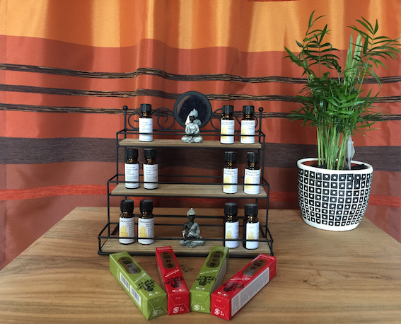
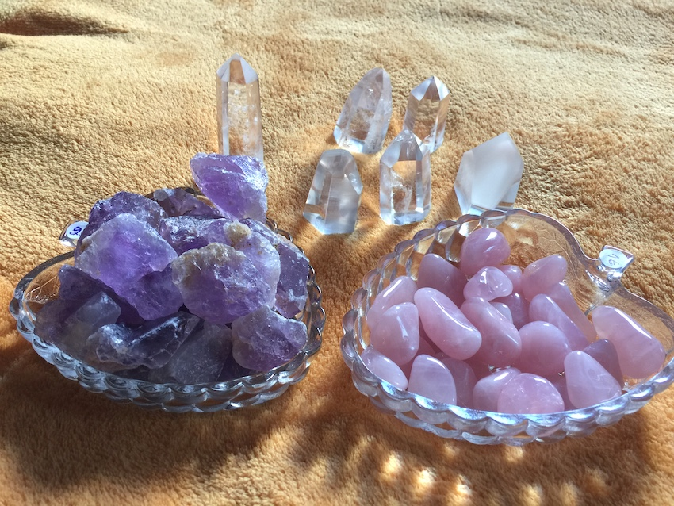

# 't Winkelhoekje

Ik bied een beperkt aantal zaken te koop aan, waarvan ik vind dat ze veel waarde hebben. Enerzijds in de ondersteuning van je energie en goed gevoel, anderzijds in het helpen van je persoonlijk ontwikkeling; ik gebruik de producten ook allemaal zelf in de praktijk, voor mezelf, voor klanten. 

Je kan een aantal **etherische oliën** kopen, om eventueel te verdampen of in het badwater te doen, of te mengen bij een andere neutrale olie om zo je lichaam mee in te masseren.
Deze oliën worden tijdens je persoonlijke consultatie zelf ook gebruikt, als extra aroma ondersteuning.

Van **wierook** zijn enkel de geur Den en Sandelhout te verkrijgen. Deze 2 geuren zijn de meest pure en natuurlijke.
Deze wierook wordt vooral ingezet bij Feng Shui correcties.

**Witte salie** is zeer goed om je eigen energie en die van je huis mee te zuiveren, wanneer je je moe of leeg voelt, wanneer je energieën van anderen hebt overgenomen, of wanneer negatieve energieën zich in jouw veld hebben vastgezet.

Er zijn verschillende wierook**houders** en olie**branders** voor handen.

**Minerale gesteenten** helpen tijdens meditatie, of ondersteunen verder je energie op verschillende niveaus, o.a. bij chakra healing.

  

Meer uitleg over de oliën en de gesteenten:

---
**Eucalyptus globulus**  
+ geeft meer adem 
+ ontsmet de lucht
+ stimuleert het verdrijven van slijmen 
+ verhoogt het concentratievermogen 
+ ondersteunt het logisch denken
+ werkt stimulerend bij onder andere burn-out 
+ gaat verwardheid tegen 
+ kalmeert bij woedeaanvallen  

**Eucalyptus citriodora - Citroen eucalyptus**  
+ sterk krampstillend
+ sterk ontstekingsremmend 
+ pijnstillend en verzachtend voor de huid 
+ schimmeldodend
+ bloeddruk verlagend
+ muggen afwerend  

**Lavandula angustifolia - Lavendel**  
+ kalmerend, verzachtend 
+ opbeurend en brengt de geest in balans
+ ontspannend
+ helpt tegen slapeloosheid en stress  

**Melaleuca alternifolia - Tea Tree**  
+ antiseptische en bacteriedodende werking 
+ desinfecteert snij- en schaafwondjes
+ extra voordelen: vlekt niet, prikt niet op wondjes  

**Pelargonium graveolens - Geranium**  
+ kalmeert en ontspant bij hevige emotionele druk
+ tegen depressies, herstelt het innerlijke evenwicht
+ verdrijft slechte gedachten en onvriendelijke stemmingen
+ opent de ogen voor de mooie kanten van het leven
+ beschouwd als vrouwelijke olie: daarom goed bij premenstrueel syndroom en klachten tijdens de menopauze

**Bergkristal**
+ reinigt, zuivert, versterkt
+ ondersteunt het zelfhelend vermogen van het lichaam
+ heft energetische blokkades op
+ ontwikkelt bij meditatie de intuïtie en het derde oog
+ geeft heldere inzichten
+ verbetert concentratie

**Amethist**
+ bevordert creativiteit
+ bij meditatie helpt het de visualisatie
+ geeft helderheid en ontspanning
+ stimuleert spirituele groei
+ verbindt boven en beneden
+ vermindert stress en zenuwachtigheid
+ stimuleert zelfbeheersing
+ brengt stabiliteit

**Rozenkwarts**
+ ondersteunt de hartchakra
+ helpt om een "heler" mens te worden
+ voor kinderen en pubers brengt het verbinding met zachte liefde en veilig gevoel
+ leert je van jezelf te houden
+ kalmeert en brengt troost

**Seleniet**
+ werkt op zonnevlecht en 2e chakra
+ versterkt intuïtie en werking met Engelen
+ versterkt meditatie
+ ontstresst, kalmeert
+ absorbeert emotionele disbalans
+ helpt hormonen te regelen

