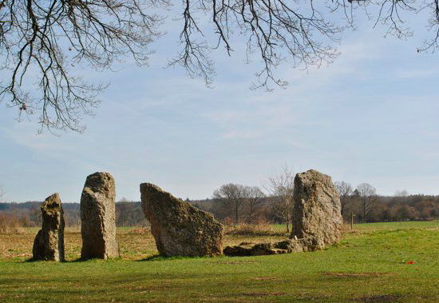
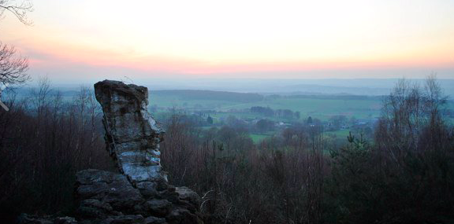

**ONTDEK DE KRACHT VAN DOLMEN EN MENHIRS IN WÉRIS**

Daguitstap, provincie Luxemburg

We gaan de mooie natuur rond Durbuy verkennen, maar we laten het toeristische achterwege. We duiken de geschiedenis in en maken kennis met de oude bouwwerken van Wéris, de dolmen en menhirs. Dat waren in die tijd "krachtplekken" van de natuur. Je wordt uitgenodigd je mee open te stellen voor die energie en te kijken wat het met je doet. Het zijn uitstekende plekken om diepgaandere meditaties te doen. 

Komende data:        
vrijdag 14 augustus (onder voorbehoud van corona)   
Kostprijs: 75€   

Eigen lunchpakket en drinken meenemen, stapschoenen, kledij aangepast aan het weer.   

Check telkens wel de Facebook pagina voor het laatste nieuws, updates, e.d.!

