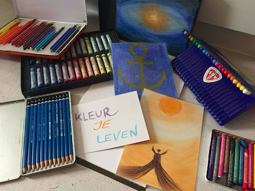
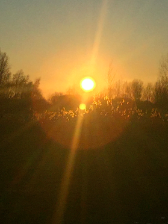
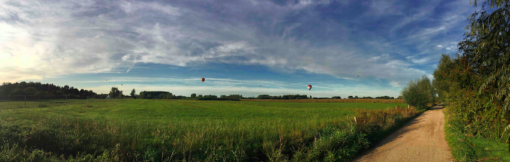

# Workshops

**KLEUR JE LEVEN**

In deze workshop mag je lekker kleuren met alles wat voorhanden is: pastelkrijt, stiften, wasco's, kleurpotloden, aquarel potloden,... of breng gerust je eigen gerief mee. 
De bedoeling van deze workshop is dat je via je tekening zicht krijgt op je eigen binnenwereld. Wat helpt je, wat blokkeert je? Je tekening als richtingaanwijzer van je intuïtie. Ik coach je door je ervaring, en samen met de anderen van de groep creeëren we extra dynamiek en groepsinzicht. 
Een speelse kleurrijke manier om tot dieper bewustzijn te komen!

Komende data:    
zaterdag 11 juli 14u-16:30u   
zaterdag 8 augustus 14-16:30u   
Kostprijs: 50€

Check Facebook pagina voor het laatste nieuws, updates, e.d.!

---

**MODERNE SJAMAAN NATUURWANDELING**   

Sjamanen in de geschiedenis van vele verschillende volkeren waren 'zieners' die over een verhoogde graad van bewustzijn beschikten. Je hoeft geen sjamaan in de letterlijke zin van het woord te zijn. Het volstaat om met open geest en veel respect voor het leven en de natuur je te laten leiden door ogenschijnlijke 'toevalligheden'.
In deze wandeling kan je daar al een stukje van leren kennen. Je leert dat alles wat je tegen komt een diepere betekenis heeft, voor jou, voor de groep. En vanuit die betekenis krijg je weer meer inzicht in wat er bij je speelt.    

De wandeling vindt plaats in de Kalkense Meersen.    
Bij slecht weer wordt het programma aangepast aan een sjamanistische intuïtie-oefening binnen. 

Komende data:    
zaterdag 25 juli 14u-16u   
zaterdag 22 augustus 14-16u   
Kostprijs: 25€   

Check telkens wel de Facebook pagina voor het laatste nieuws, updates, e.d.!

---

