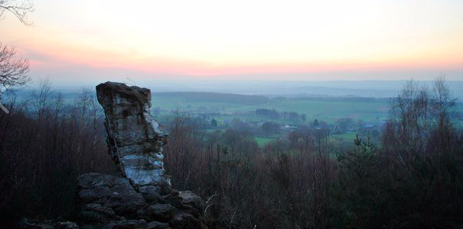

# Workshops

**KLEUR JE LEVEN**

In deze workshop mag je lekker kleuren met alles wat voorhanden is: pastelkrijt, stiften, wasco's, kleurpotloden, aquarel potloden,... of breng gerust je eigen gerief mee. 
De bedoeling van deze workshop is dat je via je tekening zicht krijgt op je eigen binnenwereld. Wat helpt je, wat blokkeert je? Je tekening als richtingaanwijzer van je intuïtie. Ik coach je door je ervaring, en samen met de anderen van de groep creeëren we extra dynamiek en groepsinzicht. 
Een speelse kleurrijke manier om tot dieper bewustzijn te komen!

Komende data:    
zaterdag 11 juli 14u-16u   
zaterdag 8 augustus 14-16u   
Kostprijs: 50€

Check telkens wel de Facebook pagina voor het laatste nieuws, updates, e.d.!

---

**MODERNE SJAMAAN NATUURWANDELING**   

Sjamanen in de geschiedenis van vele verschillende volkeren waren 'zieners' die over een verhoogde graad van bewustzijn beschikten. Je hoeft geen sjamaan in de letterlijke zin van het woord te zijn. Het volstaat om met open geest en veel respect voor het leven en de natuur je te laten leiden door ogenschijnlijke 'toevalligheden'.
In deze wandeling kan je daar al een stukje van leren kennen. Je leert dat alles wat je tegen komt een diepere betekenis heeft, voor jou, voor de groep. En vanuit die betekenis krijg je weer meer inzicht in wat er bij je speelt.    

De wandeling vindt plaats in de Kalkense Meersen. 

Komende data:    
zaterdag 25 juli 14u-16u   
zaterdag 22 augustus 14-16u   
Kostprijs: 25€   

Check telkens wel de Facebook pagina voor het laatste nieuws, updates, e.d.!

---
**ONTDEK DE KRACHT VAN DOLMEN EN MENHIRS IN WÉRIS**

Daguitstap, provincie Luxemburg

We gaan de mooie natuur rond Durbuy verkennen, maar we laten het toeristische achterwege. We duiken de geschiedenis in en maken kennis met de oude bouwwerken van Wéris, de dolmen en menhirs. Dat waren in die tijd "krachtplekken" van de natuur. Je wordt uitgenodigd je mee open te stellen voor die energie en te kijken wat het met je doet. Het zijn uitstekende plekken om diepgaandere meditaties te doen. 

Komende data:        
vrijdag 14 augustus (onder voorbehoud van corona)   
Kostprijs: 75€   

Eigen lunchpakket en drinken meenemen, stapschoenen, kledij aangepast aan het weer.   

Check telkens wel de Facebook pagina voor het laatste nieuws, updates, e.d.!

